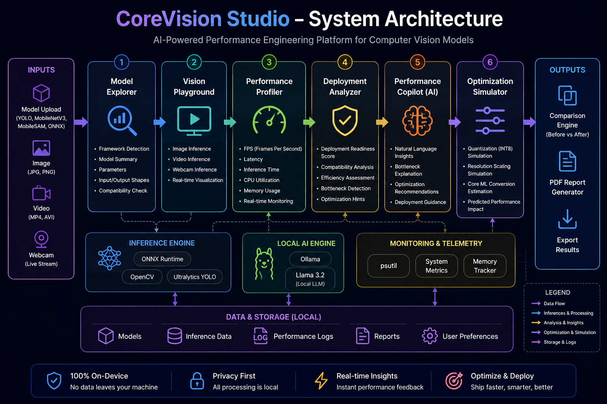
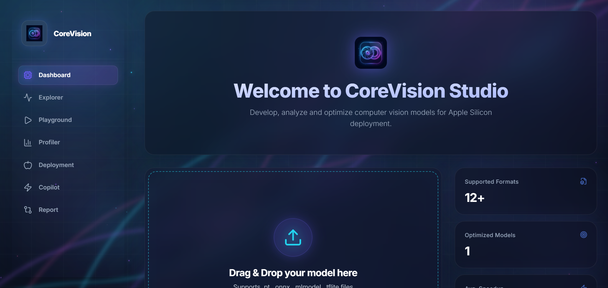
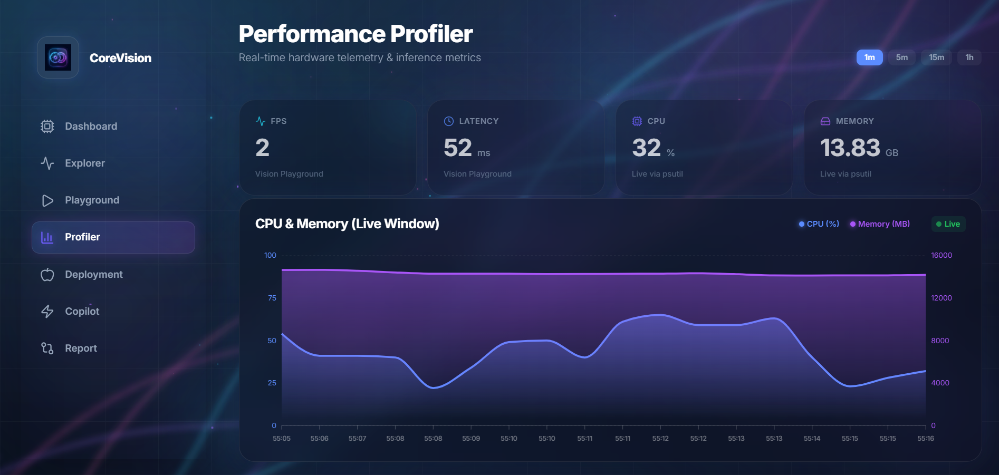
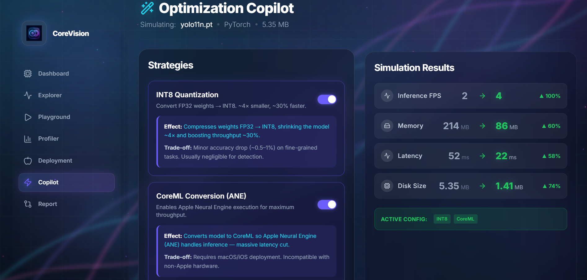

# CoreVision Studio

## AI-Powered Performance Engineering Platform for Computer Vision Models

CoreVision Studio is an intelligent developer toolkit that helps engineers analyze, optimize, and prepare computer vision models for deployment.

Instead of relying on multiple disconnected tools, developers can inspect models, monitor performance, identify bottlenecks, simulate optimizations, compare results, and generate deployment reports from a single interface.

Supported model types include:

- YOLO
- MobileNetV3
- MobileSAM
- ONNX Models
- Custom Computer Vision Models

---

## Problem Statement

Developers working with computer vision models often struggle to answer critical deployment questions:

- Is my model fast enough?
- Why is it slow?
- How much memory does it consume?
- What should I optimize?
- Is it deployment-ready?

Today, answering these questions requires multiple tools and manual analysis.

CoreVision Studio solves this by providing a unified performance engineering workflow.

---

## Key Features

### Model Explorer
- Model metadata inspection
- Framework analysis
- Parameter analysis
- Input/output shape detection
- Model compatibility checking

### Vision Playground
- Image inference
- Video inference
- Webcam inference
- Real-time visualization

### Performance Profiler
- FPS monitoring
- Latency tracking
- CPU utilization
- Memory usage analysis
- Inference timing

### Deployment Analyzer
- Deployment Readiness Score
- Compatibility checks
- Performance assessment
- Optimization readiness analysis

### Performance Copilot
- Local AI-powered recommendations
- Bottleneck identification
- Optimization suggestions
- Performance explanations

### Optimization Simulator
- Quantization simulation
- Resolution scaling simulation
- CoreML conversion estimation
- Predicted performance improvements

### Comparison Engine
- Before vs After comparison
- Performance improvement tracking
- Resource utilization comparison

### Report Generator
- PDF export
- Optimization summary
- Deployment analysis report

---

## Architecture



### System Workflow

```text
Model Upload
      ↓
Model Explorer
      ↓
Inference Engine
      ↓
Performance Profiler
      ↓
Deployment Analyzer
      ↓
Performance Copilot
      ↓
Optimization Simulator
      ↓
Comparison Engine
      ↓
Report Generator
```

---

## Project Screenshots

### Dashboard


### Performance Profiler


### Optimization Simulator


---

## Tech Stack

### Frontend
- React
- TypeScript
- Vite
- Tailwind CSS
- Framer Motion
- Recharts
- Three.js
- React Three Fiber
- jsPDF

### Backend
- Python
- FastAPI
- OpenCV
- ONNX Runtime
- Ultralytics YOLO
- psutil

### Local AI
- Ollama
- Llama 3.2

### Supported AI Models
- YOLO
- MobileNetV3
- MobileSAM
- ONNX Models

---

## Installation

### Clone Repository

```bash
git clone https://github.com/username/CoreVisionStudio.git
cd CoreVisionStudio
```

### Install Frontend Dependencies

```bash
cd frontend
npm install
```

### Install Backend Dependencies

```bash
cd backend

pip install fastapi \
uvicorn \
ollama \
ultralytics \
opencv-python \
psutil \
python-multipart \
onnxruntime
```

### Install Local AI Model

```bash
ollama pull llama3.2

ollama serve
```

---

## Running the Project

### Start Backend

```bash
python backend/main.py
```

### Start Frontend

```bash
cd frontend

npm run dev
```

Frontend:

```text
http://localhost:5173
```

Backend:

```text
http://localhost:8000
```

---

## Sample Workflow

### Step 1
Upload a Computer Vision Model

Examples:
- YOLO
- MobileNetV3
- MobileSAM
- ONNX Model

### Step 2
Inspect Model Information

View:
- Framework
- Parameters
- Input Shape
- Output Shape
- Model Size

### Step 3
Run Inference

Execute inference using:
- Image
- Video
- Webcam

### Step 4
Monitor Performance

Track:
- FPS
- Latency
- CPU Usage
- Memory Usage
- Inference Time

### Step 5
Generate Deployment Insights

Receive:
- Readiness Score
- Bottleneck Analysis
- Optimization Recommendations

### Step 6
Simulate Optimizations

Test:
- Quantization
- Resolution Scaling
- CoreML Conversion

### Step 7
Compare Results

Analyze:
- Before Optimization
- After Optimization

### Step 8
Export Report

Generate a complete deployment report in PDF format.

---

## Expected Outputs

CoreVision Studio provides:

| Metric | Description |
|----------|-------------|
| FPS | Frames Per Second |
| Latency | Model Response Time |
| Inference Time | Processing Duration |
| CPU Usage | Processor Utilization |
| Memory Usage | RAM Consumption |
| Deployment Score | Readiness Assessment |
| Recommendations | Optimization Suggestions |
| Comparison Report | Before vs After Analysis |

---

## Local AI Verification

### Fully On-Device Components

The following components run completely on-device:

- Llama 3.2 via Ollama
- ONNX Runtime Inference
- YOLO Inference
- MobileNetV3 Processing
- MobileSAM Processing
- Performance Analysis
- Deployment Recommendations

### Internet Requirements

Internet access is required only for:

- Initial dependency installation
- Downloading Ollama models

No internet connection is required during normal operation.

### Data Privacy

- No user data leaves the device
- No cloud APIs are required
- No images are uploaded externally
- All inference runs locally
- All analysis is performed on-device

---

## Technical Highlights

| Component | Technology |
|------------|------------|
| Local AI Assistant | Llama 3.2 |
| Runtime | ONNX Runtime |
| Computer Vision | YOLO, MobileSAM, MobileNetV3 |
| Backend | FastAPI |
| Frontend | React + TypeScript |
| Visualization | Recharts + Three.js |
| Reporting | jsPDF |

---

## Performance Engineering Workflow

```text
Analyze
   ↓
Profile
   ↓
Understand
   ↓
Optimize
   ↓
Compare
   ↓
Deploy
```

CoreVision Studio helps developers understand why a model performs the way it does and provides actionable recommendations to improve deployment efficiency.

---

## Privacy & Safety

- All processing occurs locally
- Camera streams are processed on-device
- No user data is transmitted externally
- Reports are generated locally
- No cloud inference is required
- Users should validate deployment recommendations before production use

---

## Attribution

### Models
- Llama 3.2 — Meta
- YOLO — Ultralytics
- MobileNetV3
- MobileSAM

### Frameworks & Libraries
- React
- TypeScript
- Vite
- Tailwind CSS
- FastAPI
- Ollama
- ONNX Runtime
- OpenCV
- Three.js
- React Three Fiber
- Framer Motion
- Recharts
- jsPDF
- Lucide React
- psutil

---

## Team Aether

### CoreVision Studio

**AI-Powered Performance Engineering Platform for Computer Vision Models**

*"We didn't build another AI model. We built the toolkit developers need before deploying one."*
